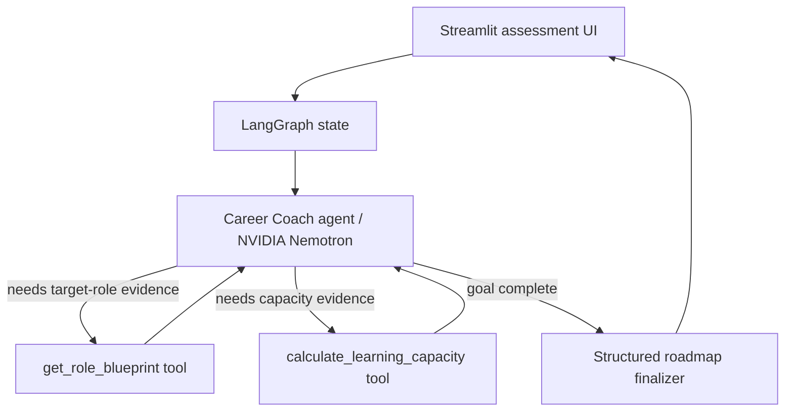

# CareerPilot AI — Stateful AI Career Coach Agent

A showcase-quality **single AI agent** that assesses a learner's current experience against a target AI role, autonomously uses tools for role requirements and learning-capacity calculations, and returns an evidence-oriented learning roadmap.

> The project is intentionally built as a real agent, not a `form -> prompt -> LLM -> text` wrapper.

## Why this project exists

General-purpose assistants can already generate career advice. CareerPilot's V1 demonstrates the engineering foundations required to turn that capability into a controlled product: **state, tool calling, agent routing, typed output, evaluation, observable execution, UI, tests, and deployment structure**.

The longer-term product direction is continuous career-state management: learner progress, evidence validation, resume/job-market inputs, adaptive reassessment, and eventually multi-agent specialization.

## Agent architecture



The core loop is:

**Reason -> request tool -> execute tool -> observe result -> reason again -> finish**

LangGraph manages state and routing; NVIDIA Nemotron provides model judgement; Python tools provide deterministic capabilities.

## Model provider

The default hosted model is:

```text
nvidia/nemotron-3-ultra-550b-a55b
```

It is accessed through NVIDIA's OpenAI-compatible NIM endpoint:

```text
https://integrate.api.nvidia.com/v1
```

The graph itself is provider-neutral. `career_coach/model_provider.py` isolates model configuration so another OpenAI-compatible model provider can be substituted without redesigning state, tools, routing, or schemas.

## V1 capabilities

- Structured learner assessment via Streamlit
- Single-agent LangGraph state machine
- NVIDIA Nemotron tool calling through an OpenAI-compatible endpoint
- Internal target-role competency blueprint tool
- Deterministic learning-capacity tool
- Conditional loop between model and tools
- Pydantic-validated final roadmap
- In-memory thread checkpointing
- Observable tool-call trace without exposing hidden reasoning
- Unit tests + optional live integration test
- GitHub Actions CI
- Streamlit/LangGraph deployment-ready project structure

## What V1 deliberately does **not** claim

- No live LinkedIn/Naukri/job-market ingestion yet
- No Udemy progress integration yet
- No resume repository yet
- No long-term production database yet
- No claim that completing a course proves competence

Those are planned evolutions, not hidden behind a demo prompt.

## Project structure

```text
.
├── app.py
├── career_coach/
│   ├── graph.py            # LangGraph nodes, edges, agent loop
│   ├── model_provider.py   # NVIDIA/OpenAI-compatible provider adapter
│   ├── state.py            # shared agent state
│   ├── tools.py            # deterministic agent tools
│   ├── schemas.py          # learner + roadmap product contracts
│   ├── prompts.py          # agent policy
│   └── presentation.py     # safe execution trace for UI
├── data/
│   └── role_blueprints.json
├── tests/
├── .github/workflows/ci.yml
├── langgraph.json
├── pyproject.toml
└── requirements.txt
```

## Run locally

### 1. Clone and create an environment

```bash
git clone https://github.com/agileskool/ai-career-coach-agent.git
cd ai-career-coach-agent
python -m venv .venv
```

Activate it:

```bash
# Windows
.venv\Scripts\activate

# macOS/Linux
source .venv/bin/activate
```

Install dependencies:

```bash
pip install -e ".[dev]"
```

### 2. Configure NVIDIA

Copy `.env.example` to `.env` and add your key:

```text
NVIDIA_API_KEY=...
NVIDIA_MODEL=nvidia/nemotron-3-ultra-550b-a55b
NVIDIA_BASE_URL=https://integrate.api.nvidia.com/v1
```

Do not commit `.env` or your API key.

### 3. Run tests

```bash
pytest
ruff check .
```

### 4. Run the UI

```bash
streamlit run app.py
```

## Interview explanation

### Why is this an agent rather than a normal LLM application?

The application does not hard-code every intelligence step. The Career Coach model receives a goal, current state, and available tools. It can request a tool; the application executes it; the result is added back to state; and the model runs again to decide whether another action is needed or the goal is complete. LangGraph controls that loop and makes state/routing explicit.

### What are the LangGraph primitives here?

- **State:** learner profile, messages, tool observations, LLM-call count, final roadmap
- **Node:** model reasoning, tool execution, final structured-output generation
- **Edge:** START -> agent, agent -> tools/finalize, tools -> agent, finalize -> END

### What is deterministic vs AI-driven?

- **AI judgement:** transferable skills, gap prioritization, pathway design, feasibility interpretation
- **Deterministic code/tools:** role blueprint retrieval, learning-hour calculation, schema validation, UI rendering

### Why NVIDIA Nemotron 3 Ultra?

The project uses NVIDIA's hosted Nemotron 3 Ultra endpoint as the initial reasoning model because it is explicitly positioned for agentic reasoning, planning and tool use. The architecture does not depend on NVIDIA-specific graph logic; the model sits behind a provider adapter.

### How would this evolve to production?

1. Replace in-memory checkpointing with Postgres.
2. Add authenticated learner profiles and long-term progress state.
3. Add resume/portfolio ingestion.
4. Add legitimate job-market data sources and role-demand evidence.
5. Add learning-platform progress connectors.
6. Add evaluations for roadmap quality, unnecessary tool calls, hallucination, and pathway personalization.
7. Split responsibilities into specialized agents only when the single-agent boundary becomes a real limitation.

## Evaluation philosophy

The product distinguishes **claimed**, **learned**, and **demonstrated** capability. A course completion can update learning evidence, but portfolio work or assessments should be required before marking a skill as demonstrated.

## Deployment

For a simple showcase deployment, deploy `app.py` on Streamlit Community Cloud and configure `NVIDIA_API_KEY` as a secret/environment variable. Never place the key in the repository.

`langgraph.json` also exposes the graph as `career_coach`, leaving room for LangGraph-compatible deployment infrastructure later.

## Roadmap

- **V0.1:** single assessment + tool-using agent + structured roadmap
- **V0.2:** persistent learner profile and reassessment
- **V0.3:** resume + portfolio evidence ingestion
- **V0.4:** current job-market intelligence
- **V0.5:** learning-provider integrations
- **V1.0:** continuous evidence-based Career Operating System
