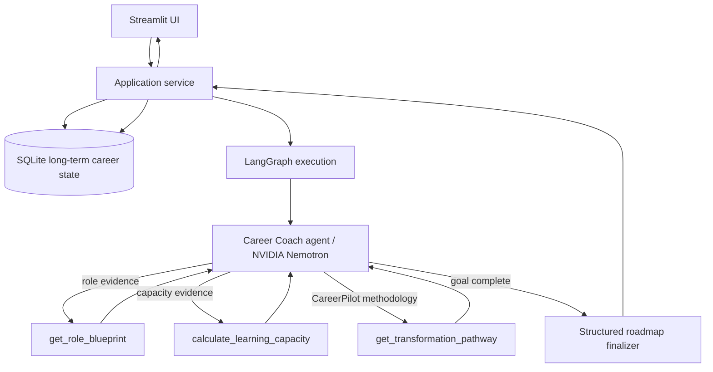

# CareerPilot AI — Persistent AI Career Coach Agent

A showcase-quality **single AI agent** that assesses a learner's current experience against a target AI role, autonomously uses tools, preserves career state across sessions, and reassesses progress instead of generating a fresh one-shot roadmap every time.

> CareerPilot is intentionally built as a real agentic product, not a `form -> prompt -> LLM -> text` wrapper.

## Why this project exists

General-purpose assistants can already generate career advice. CareerPilot demonstrates the engineering required to turn that capability into a controlled product: **state, tool calling, agent routing, long-term persistence, typed output, evaluation, observable execution, UI, tests, and deployment structure**.

V0.2 moves the project beyond one-shot advice by adding persistent learner identity, saved roadmaps, progress updates, and longitudinal reassessment.

## Agent architecture



The core agent loop is:

**Reason -> request tool -> execute tool -> observe result -> reason again -> finish**

The longitudinal product loop is:

**Assess -> save -> learner progresses -> reload saved state -> reassess -> reprioritize -> save again**

## Short-term state vs long-term memory

CareerPilot deliberately separates two concepts:

- **LangGraph state:** working memory for one agent execution — messages, tool observations, profile context, and final roadmap.
- **SQLite persistence:** long-term product memory across sessions — learner ID, profile history, saved assessments, and progress updates.

A fresh LangGraph thread is used for each assessment/reassessment. Long-term continuity comes from explicitly loading trusted product state from SQLite into the next run.

## Model provider

The default hosted model is:

```text
nvidia/nemotron-3-ultra-550b-a55b
```

It is accessed through NVIDIA's OpenAI-compatible NIM endpoint:

```text
https://integrate.api.nvidia.com/v1
```

`career_coach/model_provider.py` isolates model configuration so another compatible provider can be substituted without redesigning the graph, tools, persistence, or schemas.

## V0.2 capabilities

- New-learner assessment via Streamlit
- Persistent learner ID
- SQLite profile, roadmap, and progress history
- Returning-learner progress update flow
- Longitudinal reassessment using the previous roadmap + saved progress evidence
- Single-agent LangGraph state machine
- NVIDIA Nemotron tool calling
- Internal target-role competency blueprint tool
- Deterministic learning-capacity tool
- **CareerPilot transformation-methodology tool**
- Conditional model/tool loop
- Pydantic-validated final roadmap
- Reassessment-specific `progress_summary` and `next_best_actions`
- Observable tool-call trace without exposing hidden reasoning
- Unit tests + optional live integration test
- GitHub Actions CI

## CareerPilot methodology

The transformation-pathway tool encodes product-level principles rather than asking the model to invent the entire learning sequence from memory. Examples:

- preserve credible career capital instead of restarting experienced professionals from zero,
- separate course completion from demonstrated capability,
- prioritize the smallest AI capability delta that changes target-role readiness,
- require evidence artifacts such as prototypes, evaluations, PRDs, architecture diagrams, or case studies,
- sequence learning so concepts are reinforced through hands-on application.

This is an early version of the product's differentiating methodology and is expected to evolve.

## What V0.2 deliberately does **not** claim

- No live LinkedIn/Naukri/job-market ingestion yet
- No resume or portfolio parser yet
- No skill-validation engine yet
- No Udemy/course-provider progress integration yet
- SQLite is local showcase persistence, not production multi-user infrastructure
- No claim that completing a course proves competence

## Project structure

```text
.
├── app.py
├── career_coach/
│   ├── graph.py              # LangGraph nodes, edges, agent loop
│   ├── service.py            # baseline/reassessment application service
│   ├── persistence.py        # SQLite long-term learner state
│   ├── model_provider.py     # NVIDIA/OpenAI-compatible provider adapter
│   ├── state.py              # in-run graph state
│   ├── tools.py              # deterministic/grounding tools
│   ├── schemas.py            # learner + roadmap contracts
│   ├── prompts.py            # agent policy
│   └── presentation.py       # safe execution trace
├── data/
│   ├── role_blueprints.json
│   └── transformation_pathways.json
├── tests/
├── .github/workflows/ci.yml
├── langgraph.json
├── pyproject.toml
└── requirements.txt
```

## Run locally

### 1. Clone and create an environment

```bash
git clone https://github.com/agileskool/ai-career-coach-agent.git
cd ai-career-coach-agent
py -3.13 -m venv .venv
```

Activate it:

```bash
# Windows PowerShell
.\.venv\Scripts\Activate.ps1

# macOS/Linux
source .venv/bin/activate
```

Install dependencies:

```bash
python -m pip install -e ".[dev]"
```

### 2. Configure NVIDIA

Copy `.env.example` to `.env` and add your key:

```text
NVIDIA_API_KEY=...
NVIDIA_MODEL=nvidia/nemotron-3-ultra-550b-a55b
NVIDIA_BASE_URL=https://integrate.api.nvidia.com/v1
```

Optional local DB override:

```text
CAREERPILOT_DB_PATH=data/careerpilot.db
```

Do not commit `.env`, API keys, or local SQLite database files.

### 3. Run tests

```bash
python -m pytest
ruff check .
```

### 4. Run the UI

```bash
streamlit run app.py
```

## Returning-learner flow

1. Run **New learner assessment**.
2. Save the generated learner ID.
3. Later open **Update progress / reassess**.
4. Enter the learner ID and load saved career state.
5. Record only what actually changed — for example, a completed project, evaluation result, or unresolved difficulty.
6. CareerPilot loads the prior roadmap + progress history and asks the same single agent to reassess priorities.

## Interview explanation

### Why is this an agent rather than a normal LLM application?

The application does not hard-code every intelligence step. The Career Coach receives a goal, current state, policies, and available tools. The model issues tool calls; LangGraph executes and routes them; observations return to the model; and the model decides whether more actions are needed or the goal is complete.

### How is persistence different from LangGraph state?

LangGraph state is short-term execution context. SQLite is long-term product memory. On reassessment, CareerPilot explicitly reloads the saved learner profile, previous roadmap, and progress updates from SQLite and injects them into a new graph run. This avoids confusing model conversation history with durable business state.

### What is deterministic vs AI-driven?

- **AI judgement:** transferable skills, gap prioritization, feasibility interpretation, reassessment, pathway personalization.
- **Deterministic/product data:** role-blueprint lookup, learning-hour calculation, transformation methodology retrieval, SQLite persistence, schema validation, UI rendering.

### Why is the methodology a tool?

The model should not invent CareerPilot's product methodology from general pretraining. The methodology is an explicit product capability that can be versioned, tested, and eventually improved from learner outcomes.

### Why keep this single-agent for now?

The current responsibilities still fit one coherent career-coach decision boundary. Multi-agent decomposition will only be introduced when distinct responsibilities such as job-market research, evidence validation, or portfolio review require independent tools, policies, or evaluation criteria.

## Evaluation philosophy

CareerPilot treats learner statements as evidence inputs, not automatic proof of competence. Future versions will explicitly model stages such as **claimed -> learned -> practiced -> demonstrated -> validated -> market-ready**.

## Deployment note

V0.2 SQLite persistence is excellent for local demonstration, but Streamlit Community Cloud may use ephemeral local storage. A public multi-session deployment should move long-term state to a durable database such as Postgres before being positioned as persistent production infrastructure.

## Roadmap

- **V0.1:** single assessment + tool-using agent + structured roadmap ✅
- **V0.2:** persistent learner profile + transformation methodology + reassessment 🚧
- **V0.3:** resume + portfolio evidence ingestion
- **V0.4:** current job-market intelligence + stronger evaluation harness
- **V0.5:** learning-provider integrations
- **V1.0:** continuous evidence-based Career Operating System
