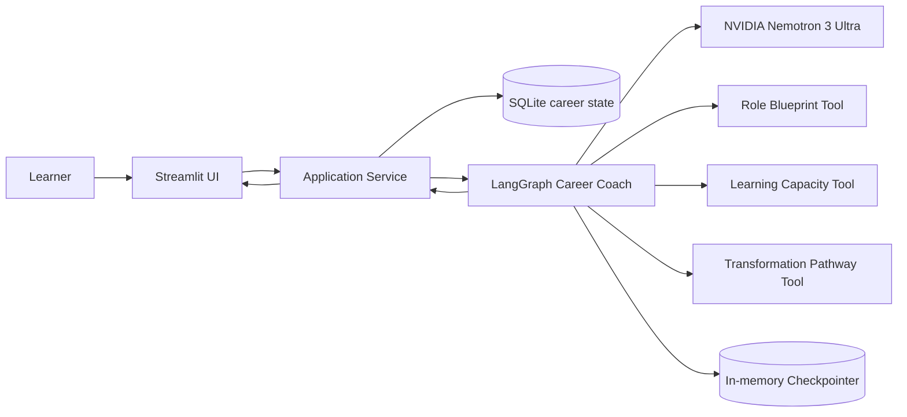
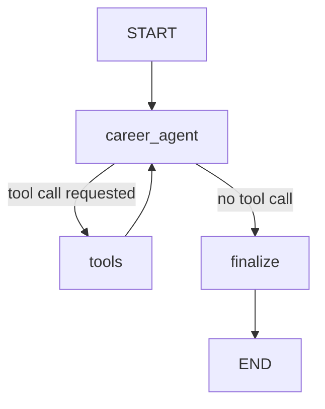
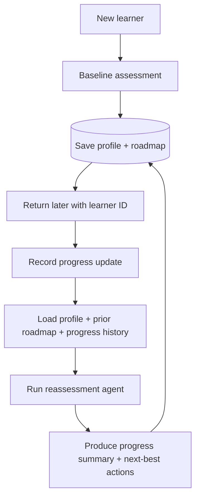

# Architecture — CareerPilot AI V0.2

## System context



## State boundary

CareerPilot intentionally separates **execution state** from **durable product memory**.

### LangGraph state — short lived

Used during one agent run:

- learner profile,
- baseline vs reassessment mode,
- previous roadmap injected for reassessment,
- progress updates injected for reassessment,
- model/tool messages,
- LLM call count,
- final roadmap.

### SQLite — long lived

Used across sessions:

- stable learner ID,
- profile history,
- saved roadmap history,
- learner-authored progress updates.

Each assessment uses a fresh LangGraph thread. Returning-learner continuity comes from explicitly loading durable state from SQLite and injecting it into the next graph invocation.

## Model-provider boundary

The LangGraph orchestration does not import an NVIDIA-specific SDK. `model_provider.py` configures a LangChain `ChatOpenAI` client against NVIDIA's OpenAI-compatible NIM endpoint. This keeps provider concerns separate from graph state, nodes, tools, persistence, routing, and schemas.

Default configuration:

```text
model    = nvidia/nemotron-3-ultra-550b-a55b
base_url = https://integrate.api.nvidia.com/v1
key      = NVIDIA_API_KEY
```

## Agent graph



The same graph handles both baseline and reassessment. The difference is the state injected at invocation time.

## Longitudinal reassessment flow



## Tool boundary

### `get_role_blueprint`

Retrieves CareerPilot's internal competency model for the target AI role. It is not positioned as live job-market data.

### `calculate_learning_capacity`

Performs deterministic timeline arithmetic so the model does not invent learning capacity.

### `get_transformation_pathway`

Retrieves CareerPilot's internal career-transition methodology. This makes product sequencing explicit, versionable, and testable rather than leaving the entire pathway to model pretraining.

## Deterministic vs probabilistic boundary

### Deterministic

- Pydantic input/output validation,
- learner ID generation,
- SQLite reads/writes,
- role blueprint retrieval,
- learning-capacity calculation,
- transformation methodology retrieval,
- graph routing based on tool-call presence,
- UI rendering.

### Probabilistic / model judgement

- identifying transferable strengths,
- prioritizing gaps,
- interpreting feasibility,
- personalizing the methodology to the learner,
- comparing progress with the previous plan,
- deciding what should be deprioritized or retained,
- recommending next-best actions.

## Why SQLite in V0.2?

SQLite gives the showcase real persistence with almost no infrastructure overhead. It is appropriate for local single-user validation and makes the long-term-memory concept concrete. It is not presented as the production architecture for a public multi-user service; that evolution would move durable state to Postgres or another managed database.

## Failure boundaries

- Unknown learner ID: service/UI stops before invoking the model.
- Missing baseline: reassessment is rejected.
- Empty progress update: UI rejects it before persistence/model invocation.
- Unsupported target role: role tool returns `not_found`; agent must not fabricate a blueprint.
- Tool exception: `ToolNode` returns an observable tool error to the model.
- Bad final structure: Pydantic validation fails rather than silently rendering malformed data.
- Runaway loop: invocation has a bounded recursion limit.
- Missing NVIDIA key: provider/UI fail before invoking the live model.
- Local DB files are ignored by Git so learner state is not committed accidentally.
