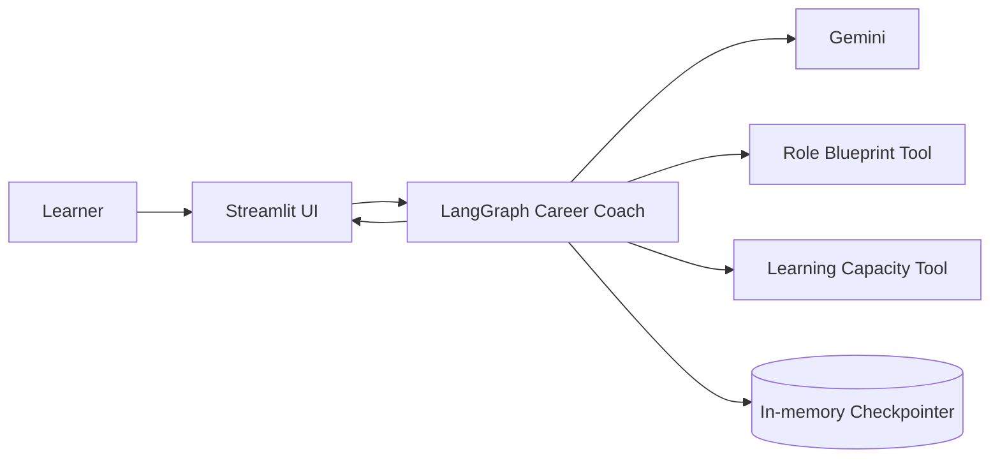
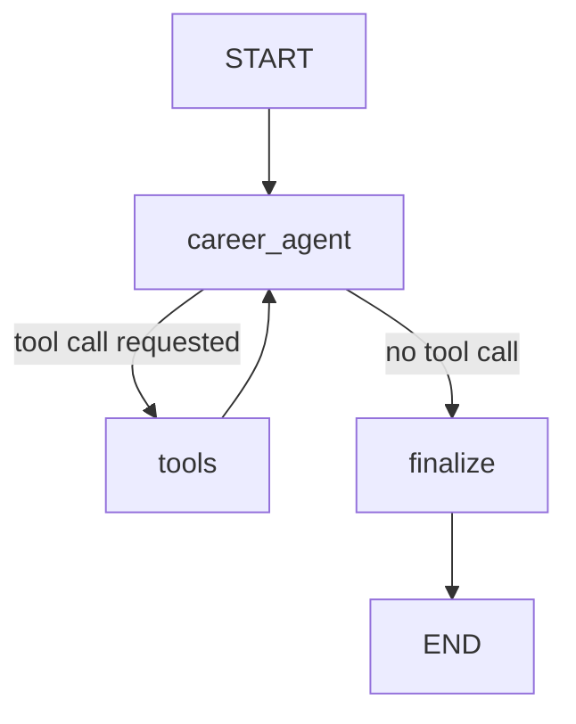

# Architecture — CareerPilot AI V0.1

## System context

## Agent graph

## 5W1H mapping

| Concept | CareerPilot implementation |
|---|---|
| What is state? | learner profile, message/tool history, LLM call count, final roadmap |
| Why a graph? | the model can request tools and loop after observations before finishing |
| Who makes judgement? | Gemini inside the `career_agent` node |
| When is code deterministic? | role lookup, capacity calculation, validation, rendering |
| Where does LangGraph sit? | between Streamlit and model/tools |
| How does agency happen? | model chooses a tool call; application executes it; observation returns to model |

## Deterministic vs probabilistic boundary

### Deterministic

- learner schema validation
- competency blueprint retrieval
- learning-capacity calculation
- graph routing based on presence of tool calls
- final schema validation
- UI rendering

### Probabilistic / model judgement

- identifying transferable strengths
- prioritizing skill gaps
- interpreting feasibility
- sequencing learning
- deciding evidence recommendations

## State and memory

V0.1 uses `InMemorySaver` for thread-level checkpointing. This demonstrates stateful execution without pretending to provide production durability. Production evolution replaces it with a database-backed checkpointer such as Postgres.

## Failure boundaries

- Unsupported target role: tool returns `not_found`; agent must not fabricate a blueprint.
- Tool exception: `ToolNode` returns an observable tool error to the model.
- Bad final structure: Pydantic validation fails rather than silently rendering malformed data.
- Runaway loop: invocation has a bounded recursion limit.
- Missing API key: UI stops before invoking the agent.
